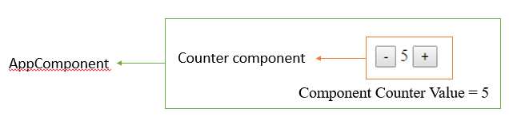

[](https://classroom.github.com/a/TBabqTs3)
[](https://classroom.github.com/open-in-codespaces?assignment_repo_id=12679188)
# CS569 Homework 03
## In a new markdown file `hw3-question1.md`:
* What is the first lifecycle hook that reads an `Input` property value?
* What causes the `ngOnChanges` lifecycle hook to trigger?
* What decorator is used to access a template variable?
* What is the first lifecycle hook that reads a template variable value?
  
## Coding Exercise
1. Create a new Angular application from CLI.
2. Create a component `Counter` that has one property `count=0`, and bind (display) the property to the template.
3. Add two buttons `"-"` and `"+"`, when clicked, the `count` should decrease/increase.
4. Display the `Counter` component as a direct child to `AppComponent`, and make sure it is working as expected.
5. Make the necessary code changes to the `Counter` and `AppComponent` components, so the `Counter` component receives the initial `count` value from the parent `AppComponent` as an `input`, and emits the `count` value as an `output` every time it changes.
  
The expected use of the `Counter` component is as follows:
```html
<app-counter [count]="initialValue" (countChange)="handleChange($event)" />
```

