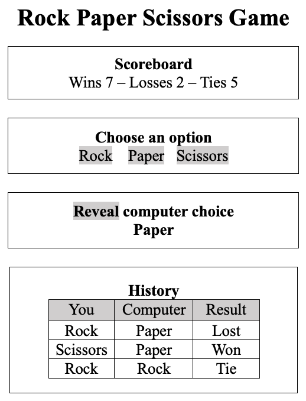

[](https://classroom.github.com/a/RikG05Bq)
[](https://classroom.github.com/open-in-codespaces?assignment_repo_id=12697008)
# CS569 Homework
Your will build a Rock-Paper-Scissors game with Angular framework, the application has the following components rendered in the following structure:  
* AppComponent (root)
  * ScoreboardComponent
  * ButtonsComponent
  * CheatingComponent
  * HistoryComponent
    
### Application Specifications
* The root AppComponent contains the application state: `{winCount: number, lossCount: number, tieCount: number, computerChoice: string}` to track number of wins/losses/ties, and the computer choice. Also history state: `[{human: string, computer: string, result: string}]`.
* Declare the game choices (Rock, Paper, Scissors) as `enum`. 
* Optimize the change detection logic when applicable.
  
<p align="center">
  
</p>

Here is something to help you with the game logic, feel free to change it for your custom solution:
```javascript
function compare(playerChoice, computerChoice) {

    //Checking for a tie
    if (playerChoice === computerChoice) {
        return "It is a tie";
    }

    //Check for Rock
    if (playerChoice === "rock") {
        if (computerChoice === "scissors") {
            return "Player Wins";
        } else {
            return "Computer Wins";
        }
    }
    //Check for Paper
    if (playerChoice === "paper") {
        if (computerChoice === "scissors") {
            return "Computer Wins";
        } else {
            return "Player Wins";
        }
    }
    //Check for Scissors
    if (playerChoice === "scissors") {
        if (computerChoice === "rock") {
            return "Computer Wins";
        } else {
            return "Player Wins";
        }
    }
}
```
To get a random value from an enum in TypeScript:
```typescript
const key = Math.floor(Math.random() * Object.keys(MyEnum).length / 2);
return MyEnum[key];
```
