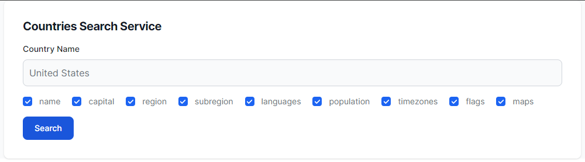

# CS569 Homework
Create an Angular application that uses the [REST Countries API](https://restcountries.com/) to search for countries by name, and the ability to customize the response fields by (`name, capital, region, subregion, languages, population, timezones, flags, maps`). All these fields are selected by default.  
  
**Validators**: The country name must not be empty, and has at least 3 characters, the country name must be checked against a service that contains banned search strings and maintained in the application state. Display an error message for each of these validation rules.  
  
**Request example**: `GET https://restcountries.com/v3.1/name/{name}?fields={field},{field},{field}`

  

