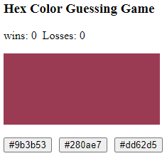
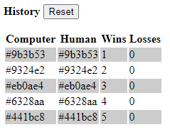

[](https://classroom.github.com/open-in-codespaces?assignment_repo_id=12714883)
## CS569-Hex Color Guessing Game
Welcome to the first workshop of the CS569 course. We are going to build a HEX color guessing game!  
  
This is an individual workshop and should not be worked in groups. Participating would give you an advantage, and not participating would not affect your standing in the course. The submission deadline is 12:00 PM.
    
Please join the Teams meeting at 2:00 PM to review and go over the solution together. Good luck to everyone, and happy coding!  
  
## Game Specifications
In this game users will have to guess the displayed color from 3 buttons as shown below:
<p align="center">
  
</p>
  
## Game Requirements
1. Create a custom directive `CheatDirective` and apply it to the displayed color space, it will allow users to double-click the displayed colored space and see an alert with the computer HEX color code. 
2. Persist the history in the `localStorage` object and restore the history and scoreboard when the app reloads. Add a button to reset the history.
3. The three Hex buttons should be disabled after 10 wins and enabled again after you reset the history.
  
<p align="center">
  
</p>

## Evaluation & Advantage
The advantage of completing the game requirements and submitting a correct solution before the deadline is to receive **3 extra points added to your final exam grade.** I will check your code submissions and send you an email confirmation by the end of the day. 
  
## Code Assistance
The two private methods below generate a random HEX color value, and pick a random value from a given array:
```typescript
  #generateRandomHexColor(): string {
    return '#' + (Math.random() * 0xFFFFFF << 0).toString(16).padStart(6, '0');
  }
  
  #getRandomItemFromArray(arr: string[]): string {
    return arr[Math.floor(Math.random() * arr.length)];
  }
```
### Code Honor Submission Policy
*Remember to respect the code honor submission policy. All written code must be original. Presenting any code as one’s own work when it came from another source is plagiarism, which includes any matching patterns and code snippets, and will affect your grade. The use of AI is not permitted in this assignment. For more details, check the full course policies in the syllabus.*
